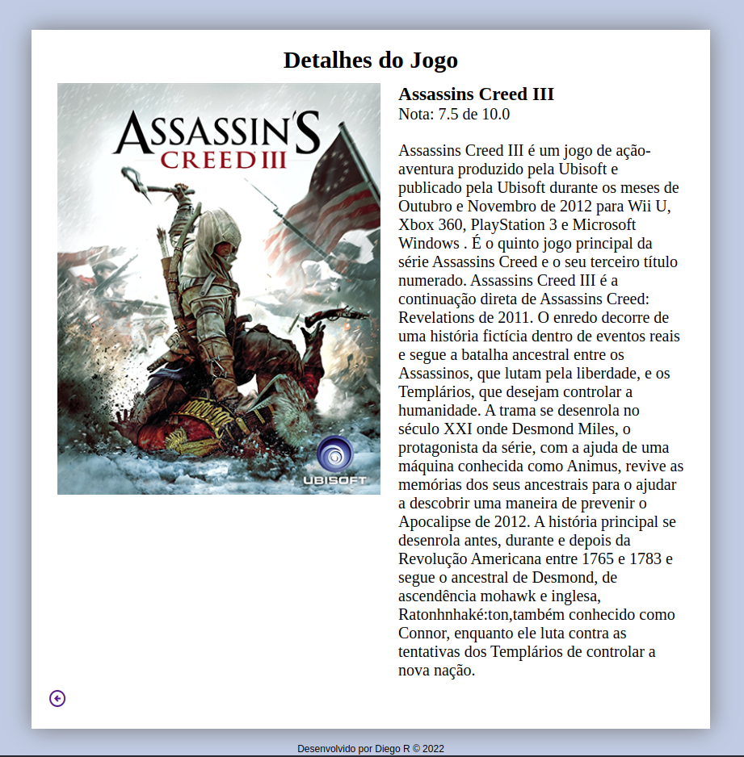

# Consultar Jogos

https://jogos.diegodevwebb.tech

  
Sistema de busca de jogos desenvolvido em
PHP. Permite aos usuários buscar os jogos
cadastrados. Caso tenha permissões de editor,
consegue editar e cadastrar novos jogos, idem
para admin, que tem permissão total de edição,
criação e exclusão de jogos.
Implementa um banco de dados SQL para
armazenar os dados dos jogos e usuários.

Para login, utilizar como editor:
Usuario: `teste`, senha:  `teste`. 
Para login como admin, utilizar:
Usuario: `diego`, senha: `83562058`

Desenvolvido com *PHP puro sem frameworks*, MySql, HTML e CSS.

